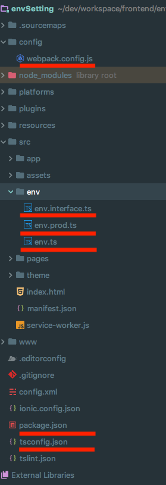
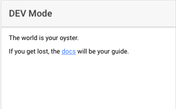
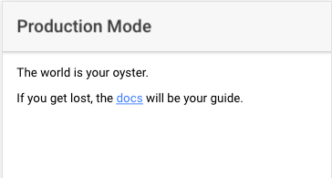

# Ionic 3.9.2 Environment Settings Starter

### Need to add below files





#### config/env-script.js
```javascript

var fs = require('fs');

function readWriteSync() {
  let env = process.env.ENV || 'dev';

  var data = fs.readFileSync(`src/env/env.${env}.ts`, 'utf-8');
  fs.writeFileSync('src/env/env.ts', data, 'utf-8');
  
  consoleOut();
}

function consoleOut() {
  let env = process.env.ENV || 'dev';
  let filePath = `src/env/env.${env}.ts`;
  
  console.log("============ PREPARE ENV FILE =============");
  console.log("                                           ");
  console.log("                 "+env+"                   ");
  console.log("              "+filePath+"                 ");
  console.log("                                           ");
  console.log("===========================================");
}

readWriteSync();
```

#### config/webpack.config.js
```javascript

var chalk = require("chalk");
var fs = require('fs');
var path = require('path');
var useDefaultConfig = require('@ionic/app-scripts/config/webpack.config.js');

//var env = process.env.IONIC_ENV;
useDefaultConfig.prod.resolve.alias = {
  "@app/env": path.resolve(environmentPath())
};

useDefaultConfig.dev.resolve.alias = {
  "@app/env": path.resolve(environmentPath())
};

function environmentPath(env) {
  //var filePath = './src/env/env' + (env === 'prod' ? '.' + env : '') + '.ts';

  var filePath = './src/env/env.ts';

  if (!fs.existsSync(filePath)) {
    console.log(chalk.red('\n' + filePath + ' does not exist!'));
  } else {
    return filePath;
  }
}

function consoleOut(env) {
  console.log("=============== ENVIRONMENT ===============");
  console.log("                                           ");
  console.log("                 "+env+"                   ");
  console.log("                                           ");
  console.log("===========================================");
}

module.exports = function () {

  var env = process.env.ENV || 'dev';

  consoleOut(env);
  return useDefaultConfig;
};

```

#### src/env/env.interface.ts
```javascript
export interface Environment {
  mode: string;
}
```

#### src/env/env.ts
```javascript
import {Environment} from "./env.interface";

export const ENV: Environment = {
  mode: "DEV"
}
```

#### src/env/env.dev.ts
```javascript
import {Environment} from "./env.interface";

export const ENV: Environment = {
  mode: "DEV"
}
```

#### src/env/env.prod.ts
```javascript
import {Environment} from "./env.interface";

export const ENV: Environment = {
  mode: "Production"
}
```

#### package.json (add below "config")
```javascript
{
  "scripts": {
    ...
    "ionic:build:before": "node ./config/env-script.js",
    "ionic:watch:before": "node ./config/env-script.js"
  },
  ...
  "config": {
    "ionic_webpack": "./config/webpack.config.js"
  },
  ...
}
```
- "ionic:build:before", "ionic:watch:before" are called 'ionic hooks'. With adding this, it will execute above commands before serve, or build ionic app.

#### tsconfig.json (add below "baseUrl, paths" in the compilerOptions object)
```javascript
{
  "compilerOptions": {
    ...
    "baseUrl" : "./src",
    "paths" : {
      "@app/env" : [
        "env/env"
      ]
    }
  },
  ...
}
```

<hr>

### Things you need to know before build

- ~~~***ionic serve*** doesn't support ***--prod***. (It means though you add ***--prod***, it just uses --dev mode)~~~
- You can use ***--prod*** option with dev mode, too.
- You can use below commands.
```
$ ENV=dev ionic cordova build ios --prod
$ ENV=prod ionic cordova build android --prod
$ ENV=prod ionic cordova build browser --prod
$ ENV=prod ionic serve
```





<hr>

### notice
***From IONIC 4, ENV variables will be handled. It means you don't need to modify or add things with webpack***
